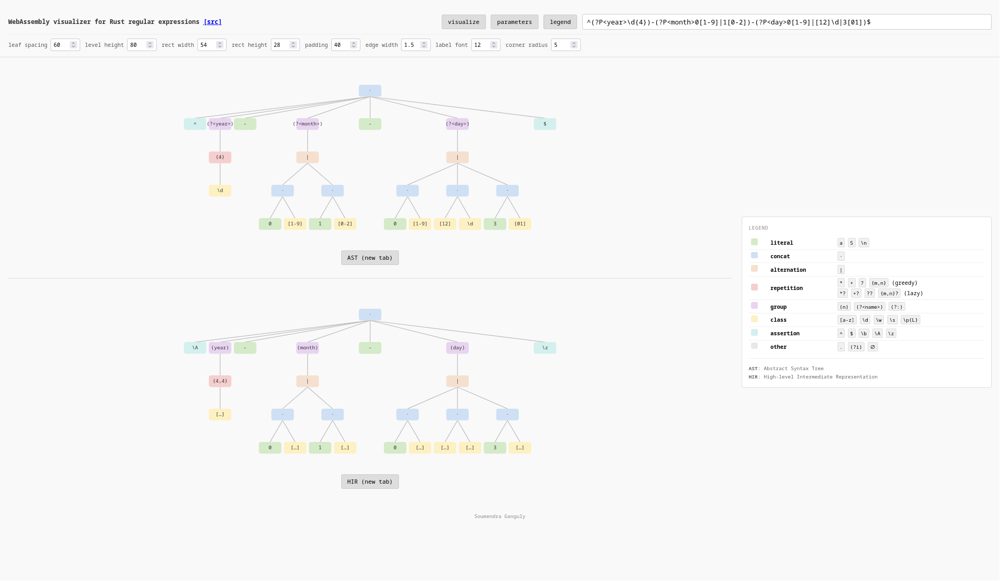

# wasm-regex-tree

WebAssembly visualizer for Rust regular expressions.

Parses Rust regular expressions using [regex-syntax](https://docs.rs/regex-syntax) and converts resulting Abstract Syntax Tree (syntactic) and High-level Intermediate Representation (semantic) to SVG.

To run it in your web browser, [click here](https://soumendraganguly.com/regex).




## Prerequisites

- [rustup](https://rustup.rs/) (installs [Rust](https://rust-lang.org/) and [Cargo](https://doc.rust-lang.org/cargo/))
- wasm32 target: `rustup target add wasm32-unknown-unknown`
- [wasm-pack](https://github.com/wasm-bindgen/wasm-pack): `cargo install wasm-pack`
- Optional for formatting and linting: `rustup component add rustfmt clippy`

## Build and run

```sh
make build && make serve
```

Then open `http://localhost:8080` in your web browser.
