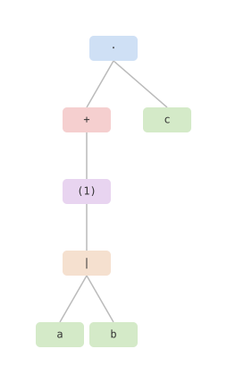

# wasm-regex-tree

WebAssembly visualizer for Rust regular expressions.

Parses Rust regular expressions using [regex-syntax](https://docs.rs/regex-syntax) and converts resulting Abstract Syntax Trees (syntactic) and High-level Intermediate Representations (semantic) to SVGs.

To run it in your web browser, [click here](https://soumendraganguly.com/regex).

<p align="center">
  
</p>

## Prerequisites

1. [rustup](https://rustup.rs/) (installs [Rust](https://rust-lang.org/) and [Cargo](https://doc.rust-lang.org/cargo/))
2. Install the wasm32 target:
```sh
$ rustup target add wasm32-unknown-unknown
```
3. Install [wasm-pack](https://github.com/wasm-bindgen/wasm-pack):
```sh
$ cargo install wasm-pack
```
4. Optional for formatting and linting:
```sh
$ rustup component add rustfmt clippy
```

## Build and run

```sh
$ make build && make serve
```

Then open `http://localhost:8080` in your web browser.
